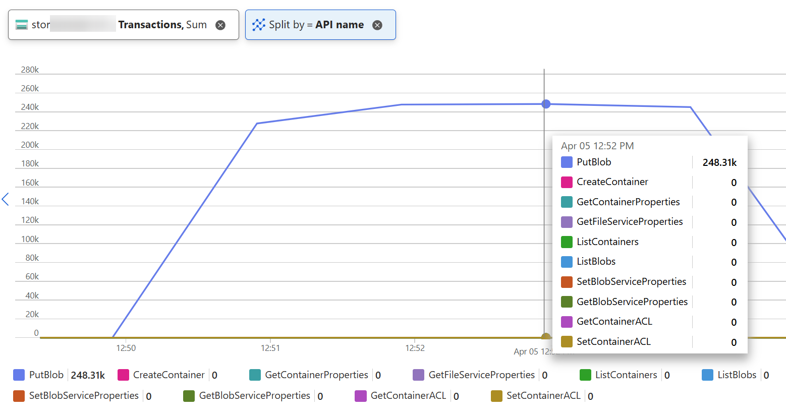
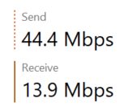
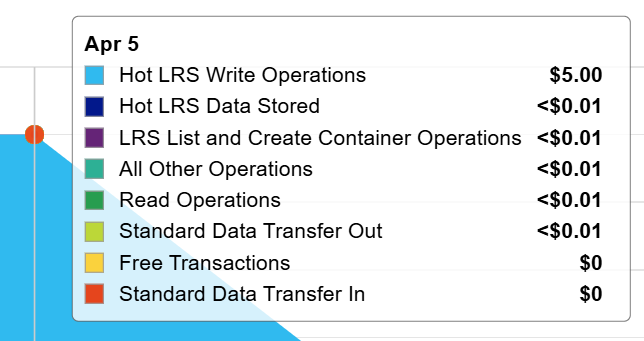
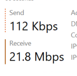
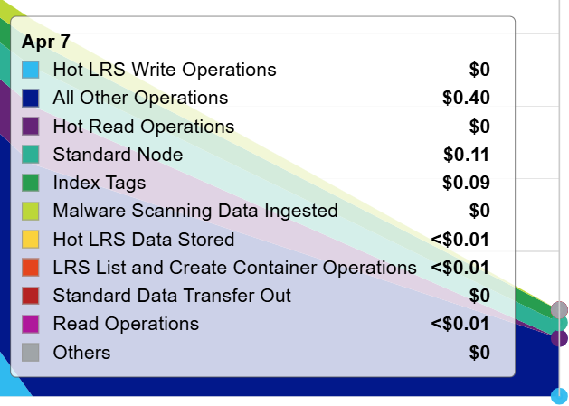

# Blob Index Tags

> [!WARNING]
> Perf testing is always tricky. Here are some
> numbers with *very* **very** limited testing.
> Your mileage *will* vary.

## Scenario

You have 10+ billion blobs in your storage account.
1 billion of them have 2
[blob index tags](https://learn.microsoft.com/en-us/azure/storage/blobs/storage-manage-find-blobs?tabs=azure-portal)
set to them.

From 
[Azure Blob Storage pricing](https://azure.microsoft.com/en-us/pricing/details/storage/blobs/),
we can estimate the costs to be:

> You're charged for the monthly average **number of index tags within a storage account**.<br/>
> Blob Index (per 10K tags): €0.0362 (Sweden Central)

Example calculation:

```text
2 tags * 1 billion blobs = 2 billion tags
2 billion tags / 10K = 200'000
200'000 * €0.0362 = €7240 per month
```

We want to remove these tags to save costs.

In the below, we'll create implementation that enables you to test this in isolation.
This allows us to run this in enough large scale so that we can extrapolate 
and better estimate the durations and costs.

Here are the high level steps:
First, we need to generate test data for this scenario.
Second, we need to find only those blobs that have tags which is in this scenario only 10 %
of the total blobs. Lastly, we'll clean the tags from blobs found in the previous step.
Each of these steps is described in detail below:

1. Generate test data
2. Upload test files
3. Export names of blobs with tags
4. Cleanup tags

## Cleanup implementation

The below tests have been executed with `Standard B8ms (8 vcpus, 32 GiB memory)` and
`Standard B4ms (4 vcpus, 16 GiB memory)` SKUs without big difference.

Storage Account was `StorageV2 (general purpose v2)` with `Locally Reduntant Storage (LRS)` replication.

Storage and virtual machine are both deployed to Sweden Central.

All the below commands expect that you have set the following variables:

```powershell
$account = "<your storage account name>"
$accountKey = "<your storage account key>"
$container = "logs"
```

### 1. Generate test data

[datagenerator](src/datagenerator/datagenerator.go)
can be used for generating local files with each row in the data file
representing blob name. 

```powershell
.\datagenerator.exe -files=20 -rows=50000 -outdir datas -prefix data
```

The above command generates `20 * 50'000 = 1'000'000` blob names.

Here are the generated files:

```console
$ dir dir datas\*

    Directory: C:\code\storage\datas

Mode                 LastWriteTime         Length Name
----                 -------------         ------ ----
-a----          4/5/2025   7:57 AM        6600000 data-1.txt
-a----          4/5/2025   7:57 AM        6600000 data-10.txt
-a----          4/5/2025   7:57 AM        6600000 data-2.txt
-a----          4/5/2025   7:57 AM        6600000 data-3.txt
-a----          4/5/2025   7:57 AM        6600000 data-4.txt
-a----          4/5/2025   7:57 AM        6600000 data-5.txt
-a----          4/5/2025   7:57 AM        6600000 data-6.txt
-a----          4/5/2025   7:57 AM        6600000 data-7.txt
-a----          4/5/2025   7:57 AM        6600000 data-8.txt
-a----          4/5/2025   7:57 AM        6600000 data-9.txt
```

Here is an example content of one file:

```
/2028/07/27/18/10/13/log-4b729115-4df5-f6c4-b778-39ff430c30d7.txt
/2024/10/03/17/43/10/log-1be210fa-2098-9296-c630-b8fed1eedf97.txt
/2027/04/10/02/06/54/log-4b65ac95-48c9-65a3-cdfb-5672f8c294bb.txt
/2026/06/05/06/27/15/log-582de2af-c3fb-a055-a516-f39f7a9b03cf.txt
/2020/10/22/14/01/14/log-f3db685c-c915-ba28-94d0-6e1bafb92e68.txt
/2025/04/28/01/36/45/log-c9f746cc-b844-a4f7-6c93-dcdd2e41de40.txt
/2025/10/17/20/39/08/log-74b193c9-65ee-01c8-2e7d-c47916a75a3c.txt
```

### 2. Upload test files

[blob-create-blobs](src/blob/create-blobs/blob-create-blobs.go)
reads the above generated files and create blobs based on those names.
Generated blobs are 1 KB in size.

```powershell
.\blob-create-blobs.exe -account="$account" -key="$accountKey" -container="$container" -indir=datas
```

Here's are storage metrics during the upload process:



Here's network usage during the upload process:



Here's an example of the storage costs from the upload:



### 3. Export names of blobs with tags

> [!NOTE]
> It might take a while after you add tags before
> they are indexed and can be found by quering with [Find Blobs by Tags](https://learn.microsoft.com/en-us/rest/api/storageservices/find-blobs-by-tags?tabs=microsoft-entra-id).

[StorageApp](src/StorageApp) can be used to export all names of the
blobs that have tags associated with them.

It only takes one parameter which is configuration file:

```powershell
dotnet run -c Release -- .\export.json
```

The configuration file contains these parameters defining the export process:

```json
{
  "operation": "export",
  "storageName": "<storage name>",
  "storageKey": "<storage key>",
  "tagFilter": "\"My field\" = \"My value\"",
  "folder": "data",
  "rowsPerFile": 1000000
}
```

Here's an example output from the command:

```console
$ dotnet run -c Release -- .\export.json
...<abbreviated>
Batch #201 fetched in 0.62 seconds (5000 blobs)
  Average batch time: 0.57 seconds
  Total time elapsed: 1.91 minutes
  Estimated throughput: 8560.99 blobs/second
Batch #202 fetched in 0.59 seconds (5000 blobs)
  Average batch time: 0.57 seconds
  Total time elapsed: 1.92 minutes
  Estimated throughput: 8560.49 blobs/second
Batch #203 fetched in 0.57 seconds (5000 blobs)
  Average batch time: 0.57 seconds
  Total time elapsed: 1.93 minutes
  Estimated throughput: 8561.04 blobs/second
Batch #204 fetched in 0.56 seconds (4394 blobs)
  Average batch time: 0.57 seconds
  Total time elapsed: 1.94 minutes
  Estimated throughput: 8562.65 blobs/second
Queued 1000000 blobs for file 1
Waiting for file writer to complete...
File writer: Wrote file 1 with 1000000 blobs in 790 ms
  Total files written: 1, Total blobs written: 1000000
File writer completed: 1 files written with 1000000 blobs in 117.07 seconds
Export completed. Total blobs: 1000000, Total files: 2
Total batches: 204, Average batch time: 0.57 seconds
Total run time: 1.95 minutes
Final throughput: 8541.84 blobs/second
Extrapolated time for 1 billion blobs: 32.52 hours
```

In repeated tests, average batch time for _5'000 records_ has been typically between 0.50 and 0.60.

Here are some estimates what it would mean for 1 billion blobs:

| Batch time (s) | Export time |
| -------------- | ----------- |
| 0.50           | 1.2 days    |
| 0.60           | 1.4 days    |
| 0.70           | 1.6 days    |

The output file size depends _a lot from path lengths_ but can be ~100 MB for 1 million rows.
To export 1 billion rows, you would most likely need 100 GB disk for the storage.

The output is written to files with configured number of blobs in them (in the above configuration it was set to 1 million):

```data
/2020/01/01/00/01/05/log-4effcae8-4412-7e7a-dfc7-df5c2807af85.txt/application/octet-stream
/2020/01/01/00/18/41/log-e92fa5b8-6889-7c6c-9e17-9c017dd15acf.txt/application/octet-stream
/2020/01/01/00/23/49/log-5d78fc74-8c5d-bc9a-1921-1babad472f57.txt/application/octet-stream
/2020/01/01/00/25/16/log-9e277e27-f073-fbd4-3410-c1e977356637.txt/application/octet-stream
```

> [!NOTE]
> You cannot parallelize this step since
> [Find Blobs by Tags](https://learn.microsoft.com/en-us/rest/api/storageservices/find-blobs-by-tags?tabs=microsoft-entra-id)
> uses `marker` to help you get the next page of results and it's opaque to the client.

Here's network usage during the export process:



### 4. Cleanup tags

[blob-set-tags](src/blob/set-tags/blob-set-tags.go)
reads the above export files and clear tags from each found blob.

```powershell
.\blob-set-tags.exe -account="$account" -key="$accountKey" -datadir="datas" -pattern="*.txt" -workers=800
```

```console
$ .\blob-set-tags.exe -account="$account" -key="$accountKey" -datadir="datas" -pattern="*.txt" -workers=200
2025/04/05 13:17:11 Using Azure Storage authentication for account: stor00000001010
2025/04/05 13:17:11 Finding data files from storageapp/StorageApp/data matching *.txt...
2025/04/05 13:17:11 Processing file: storageapp\StorageApp\data\data-1.txt
2025/04/05 13:17:11 Found 1000001 URLs in file storageapp\StorageApp\data\data-1.txt
2025/04/05 13:17:11 Processing batch 1 to 1000000 of 1000001 URLs
2025/04/05 13:17:11 Starting 200 workers to process 1000000 URLs (approx. 5000 per worker)
2025/04/05 13:17:16 Progress: 106575 completed, 0 errors, 21293.67 req/sec (current: 21293.67 req/sec)
2025/04/05 13:17:21 Progress: 221952 completed, 0 errors, 22183.60 req/sec (current: 23074.38 req/sec)
2025/04/05 13:17:26 Progress: 335786 completed, 0 errors, 22377.88 req/sec (current: 22766.63 req/sec)
2025/04/05 13:17:31 Progress: 448432 completed, 0 errors, 22415.82 req/sec (current: 22529.70 req/sec)
2025/04/05 13:17:36 Progress: 559006 completed, 0 errors, 22355.72 req/sec (current: 22115.24 req/sec)
2025/04/05 13:17:41 Progress: 676979 completed, 0 errors, 22562.05 req/sec (current: 23593.85 req/sec)
...<abbreviated>
```

To run the cleanup for `1 billion blobs`, it would roughly take:

| Request/sec | Total time |
| ----------- | ---------- |
| 10'000      | 1.2 days   |
| 20'000      | 0.6 days   |
| 30'000      | 0.4 days   |
| 40'000      | 0.3 days   |

> [!NOTE]
> You **can parallelize this step** since all the blobs have been exported to files.
> You would just split those exported files per processor (e.g., running in another virtual machine)
> to speed up the process until you reach some other limit e.g.,
> [Scalability and performance targets for standard storage accounts](https://learn.microsoft.com/en-us/azure/storage/common/scalability-targets-standard-account).

## Costs

If storing of the blob index tags was in the above example `€7240 per month`,
then here's the costs of the cleanup process from storage perspective:

| Operation                     | Count         | Pricing name                                 | Cost per 10k operations | Cost     |
| ----------------------------- | ------------- | -------------------------------------------- | ----------------------- | -------- |
| `Find Blobs by Tags` API call | 200'000       | List and Create Container operations (`Hot`) | €0.0464                 | €0.928   |
| `Set Blob Tags` API call      | 1'000'000'000 | All other Operations (`Hot`)                 | €0.0038                 | €380     |
| TOTAL                         | 1'000'200'000 |                                              |                         | €380.928 |

Of course, other costs include e.g., virtual machine(s) on top of the storage costs.
Typically, VMs in this scale category are ~300 euros per month (or less).

Here's an example of the storage costs from the cleanup with `1 million blobs`:



## Notes

The above process doesn't have to be _export first everything and then you can proceed to clearing tags_
since you can stop the export process and use files that it has already created in the process.
Therefore, you can run export process for just for e.g., 10 minutes and then stop it and then 
cleanup those tags. Just remember that it might take a bit time to get those blobs removed
from the index after you have removed the tags.
