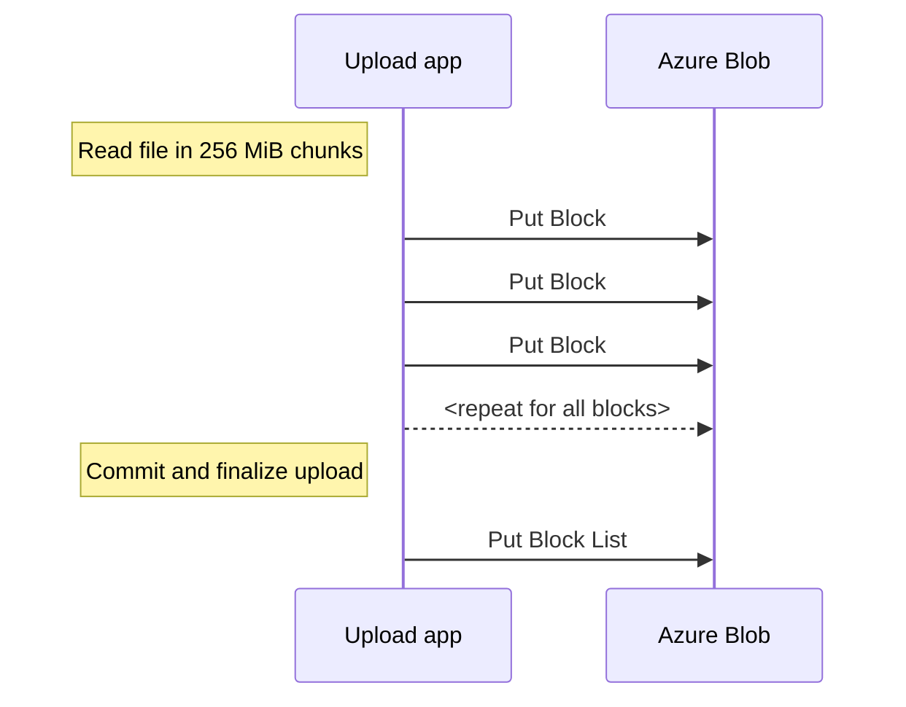

# BlockBlobs

This kind of testing is always tricky. Here are some
numbers with *very* **very** limited testing.
Your mileage *will* vary.

**Important**: [BlockBlocks](https://learn.microsoft.com/en-us/rest/api/storageservices/understanding-block-blobs--append-blobs--and-page-blobs#about-block-blobs)
**supports Maximum block size (via Put Block) up to 4000 MiB** after Service version `Version 2019-12-12 and later` 
but in this example `256 MiB` file is used as example block size. Choose whatever makes sense in your scenario.

> 268'435'456 bytes = 256 MiB = 0,25 GiB => 4000 * 256 MiB = 1000 GiB

## Upload test

Test parameters:

- Azure Storage:
  - Account kind: StorageV2 (general purpose v2)
  - Performance: Standard (HDD)
  - Replication: Locally-redundant storage (LRS)
  - Region: West Europe
- Virtual Machine:
  - SKU: [Standard_D2ds_v4](https://learn.microsoft.com/en-us/azure/virtual-machines/ddv4-ddsv4-series#ddsv4-series)
- Upload code [Python upload code](https://github.com/JanneMattila/python-examples/tree/main/azure-storage)
  - 256 MiB file generated using: `head -c 256m </dev/urandom > demo.bin`
  - Single large file is generated by uploading this file as [BlockBlob](https://learn.microsoft.com/en-us/rest/api/storageservices/understanding-block-blobs--append-blobs--and-page-blobs#about-block-blobs)
  - 4000 blocks will be generated using [Put Block](https://learn.microsoft.com/en-us/rest/api/storageservices/put-block?tabs=azure-ad) API
  - After uploading blocks, file is committed using [Put Block List](https://learn.microsoft.com/en-us/rest/api/storageservices/put-block-list?tabs=azure-ad) API call

Overview of the process:

Metrics view while uploading blocks using [Put Block](https://learn.microsoft.com/en-us/rest/api/storageservices/put-block?tabs=azure-ad) API:

Metrics view after uploading has finished and final [Put Block List](https://learn.microsoft.com/en-us/rest/api/storageservices/put-block-list?tabs=azure-ad) API call is made:

Entire upload duration API calls:

Uploaded file in container:

## Cost

### Upload to `Hot` tier

Cost of uploading `1000 GiB` to Azure Storage to `Hot` tier:
  - Account kind: StorageV2 (general purpose v2)
  - Performance: Standard (HDD)
  - Replication: Locally-redundant storage (LRS)
  - Region: West Europe

| Operation               | Count | Pricing name             | Cost per 10k operations | Cost       |
| ----------------------- | ----- | ------------------------ | ----------------------- | ---------- |
| `PutBlock` API call     | 4000  | Write Operations (`Hot`) | $0.054                  | $0.0216    |
| `PutBlockList` API call | 1     | Write Operations (`Hot`) | $0.054                  | $0.0000054 |
| TOTAL                   | 4001  |                          |                         | $0.0216054 |

Here is example pricing extract (with tiny extras due to my tests) after uploading `1000 GiB` file to `Hot` tier:

Here is same in table format:

| UsageDate  | ServiceFamily | ServiceName | Meter                                    | CostUSD   |
| ---------- | ------------- | ----------- | ---------------------------------------- | --------- |
| 2023-04-05 | Networking    | Bandwidth   | Standard Data Transfer In                | $-        |
| 2023-04-05 | Networking    | Bandwidth   | Standard Data Transfer Out               | $0,000000 |
| 2023-04-05 | Storage       | Storage     | All Other Operations                     | $0,000012 |
| 2023-04-05 | Storage       | Storage     | Batch Write Operations                   | $0,000004 |
| 2023-04-05 | Storage       | Storage     | Hot LRS Data Stored                      | $0,190543 |
| 2023-04-05 | Storage       | Storage     | Hot LRS Write Operations                 | $0,021609 |
| 2023-04-05 | Storage       | Storage     | LRS List and Create Container Operations | $0,000027 |
| 2023-04-05 | Storage       | Storage     | Read Operations                          | $0,000001 |
| 2023-04-05 | Storage       | Storage     | Write Operations                         | $0,000000 |

## Using `Archive` tier

You can [change a blob's access tier](https://learn.microsoft.com/en-us/azure/storage/blobs/access-tiers-overview#changing-a-blobs-access-tier)
after it has been uploaded, using [Set Blob Tier](https://learn.microsoft.com/en-us/rest/api/storageservices/set-blob-tier)
API call.

| Operation               | Count | Pricing name                 | Cost per 10k operations | Cost       |
| ----------------------- | ----- | ---------------------------- | ----------------------- | ---------- |
| `PutBlock` API call     | 4000  | Write Operations (`Hot`)     | $0.054                  | $0.0216    |
| `PutBlockList` API call | 1     | Write Operations (`Hot`)     | $0.054                  | $0.0000054 |
| `SetBlobTier` API call  | 1     | Write Operations (`Archive`) | $0.12                   | $0.000012  |
| TOTAL                   | 4002  |                              |                         | $0.0216174 |

You can also upload file directly to `Archive` tier:

| Operation               | Count | Pricing name                 | Cost per 10k operations | Cost      |
| ----------------------- | ----- | ---------------------------- | ----------------------- | --------- |
| `PutBlock` API call     | 4000  | Write Operations (`Hot`)     | $0.054                  | $0.0216   |
| `PutBlockList` API call | 1     | Write Operations (`Archive`) | $0.12                   | $0.000012 |
| TOTAL                   | 4001  |                              |                         | $0.021612 |
