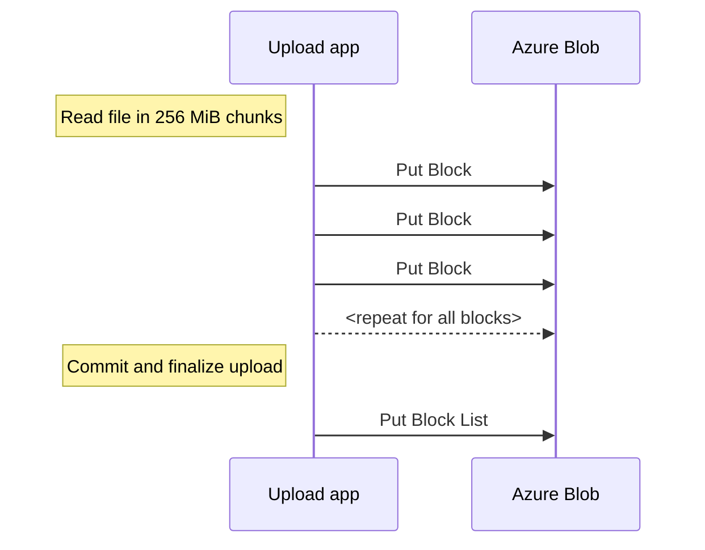

# BlockBlobs

This kind of testing is always tricky. Here are some
numbers with *very* **very** limited testing.
Your mileage *will* vary.

**Important**: [BlockBlocks](https://learn.microsoft.com/en-us/rest/api/storageservices/understanding-block-blobs--append-blobs--and-page-blobs#about-block-blobs)
**supports Maximum block size (via Put Block) up to 4000 MiB** after Service version `Version 2019-12-12 and later` 
but in this example `256 MiB` file is used as example block size. Choose whatever makes sense in your scenario.
You can always download file and [specify the range header](https://learn.microsoft.com/en-us/rest/api/storageservices/specifying-the-range-header-for-blob-service-operations)
to read it in different ranges.

> 268'435'456 bytes = 256 MiB = 0,25 GiB => 4000 * 256 MiB = 1000 GiB

## Upload test

Test parameters:

- Azure Storage:
  - Account kind: StorageV2 (general purpose v2)
  - Performance: Standard (HDD)
  - Replication: Locally-redundant storage (LRS)
  - Region: West Europe
- Virtual Machine:
  - SKU: [Standard_D2ds_v4](https://learn.microsoft.com/en-us/azure/virtual-machines/ddv4-ddsv4-series#ddsv4-series)
- Upload code [Python upload code](https://github.com/JanneMattila/python-examples/tree/main/azure-storage)
  - 256 MiB file generated using: `head -c 256m </dev/urandom > demo.bin`
  - Single large file is generated by uploading this file as [BlockBlob](https://learn.microsoft.com/en-us/rest/api/storageservices/understanding-block-blobs--append-blobs--and-page-blobs#about-block-blobs)
  - 4000 blocks will be generated using [Put Block](https://learn.microsoft.com/en-us/rest/api/storageservices/put-block?tabs=azure-ad) API
  - After uploading blocks, file is committed using [Put Block List](https://learn.microsoft.com/en-us/rest/api/storageservices/put-block-list?tabs=azure-ad) API call

Overview of the process:



Metrics view while uploading blocks using [Put Block](https://learn.microsoft.com/en-us/rest/api/storageservices/put-block?tabs=azure-ad) API:


Metrics view after uploading has finished and final [Put Block List](https://learn.microsoft.com/en-us/rest/api/storageservices/put-block-list?tabs=azure-ad) API call is made:


Entire upload duration API calls:


Uploaded file in container:


## Cost

See [Calculate costs](https://learn.microsoft.com/en-us/azure/storage/blobs/archive-cost-estimation#calculate-costs)
for more examples.

### Upload to `Hot` tier

Cost of uploading `1000 GiB` to Azure Storage to `Hot` tier:
  - Account kind: StorageV2 (general purpose v2)
  - Performance: Standard (HDD)
  - Replication: Locally-redundant storage (LRS)
  - Region: West Europe

| Operation               | Count | Pricing name             | Cost per 10k operations | Cost       |
| ----------------------- | ----- | ------------------------ | ----------------------- | ---------- |
| `PutBlock` API call     | 4000  | Write Operations (`Hot`) | $0.054                  | $0.0216    |
| `PutBlockList` API call | 1     | Write Operations (`Hot`) | $0.054                  | $0.0000054 |
| TOTAL                   | 4001  |                          |                         | $0.0216054 |

On top of above API based cost there is price of storing `1000 GiB` in `Hot` tier for `$0.0196 per GB` (with pay-as-you-go and first 50 terabyte (TB) / month).

Here is example pricing extract from one day (with tiny extras due to my tests) after uploading `1000 GiB` file to `Hot` tier:


Here is same in table format:

| UsageDate  | ServiceFamily | ServiceName | Meter                                    | CostUSD   |
| ---------- | ------------- | ----------- | ---------------------------------------- | --------- |
| 2023-04-05 | Networking    | Bandwidth   | Standard Data Transfer In                | $-        |
| 2023-04-05 | Networking    | Bandwidth   | Standard Data Transfer Out               | $0.000000 |
| 2023-04-05 | Storage       | Storage     | All Other Operations                     | $0.000012 |
| 2023-04-05 | Storage       | Storage     | Batch Write Operations                   | $0.000004 |
| 2023-04-05 | Storage       | Storage     | Hot LRS Data Stored                      | $0.190543 |
| 2023-04-05 | Storage       | Storage     | Hot LRS Write Operations                 | $0.021609 |
| 2023-04-05 | Storage       | Storage     | LRS List and Create Container Operations | $0.000027 |
| 2023-04-05 | Storage       | Storage     | Read Operations                          | $0.000001 |
| 2023-04-05 | Storage       | Storage     | Write Operations                         | $0.000000 |

API usage cost from calculation and cost analysis view shows `$0.022`.

## Using `Archive` tier

You can [change a blob's access tier](https://learn.microsoft.com/en-us/azure/storage/blobs/access-tiers-overview#changing-a-blobs-access-tier)
after it has been uploaded, using [Set Blob Tier](https://learn.microsoft.com/en-us/rest/api/storageservices/set-blob-tier)
API call.

| Operation               | Count | Pricing name                 | Cost per 10k operations | Cost       |
| ----------------------- | ----- | ---------------------------- | ----------------------- | ---------- |
| `PutBlock` API call     | 4000  | Write Operations (`Hot`)     | $0.054                  | $0.0216    |
| `PutBlockList` API call | 1     | Write Operations (`Hot`)     | $0.054                  | $0.0000054 |
| `SetBlobTier` API call  | 1     | Write Operations (`Archive`) | $0.12                   | $0.000012  |
| TOTAL                   | 4002  |                              |                         | $0.0216174 |

You can also upload file directly to `Archive` tier:

| Operation               | Count | Pricing name                 | Cost per 10k operations | Cost      |
| ----------------------- | ----- | ---------------------------- | ----------------------- | --------- |
| `PutBlock` API call     | 4000  | Write Operations (`Hot`)     | $0.054                  | $0.0216   |
| `PutBlockList` API call | 1     | Write Operations (`Archive`) | $0.12                   | $0.000012 |
| TOTAL                   | 4001  |                              |                         | $0.021612 |


Cost of storing `1000 GiB` in `Archive` tier is `$0.0018 per GB per month` (with pay-as-you-go and first 50 terabyte (TB) / month).

Here is cost per day for above test data:


Here is example calculation for transferring 500 files with size `1000 GiB` to `Archive`:
- Migration time API usage cost: `$0.021612 x 500 = $10,806`
- Permanent storage cost in `Archive`
  - `1000 GiB = 1073.74 GB` => `500 x 1073.74 GB = 536870 GB = 536.87 TB`
  - Using [Azure Storage Reserved Capacity with 3-year reservation](https://azure.microsoft.com/en-us/pricing/details/storage/blobs/) => 100 TB / month for `Archive` = $152 => `6 x $152 = $912`

If you need to do [blob rehydration](https://learn.microsoft.com/en-us/azure/storage/blobs/archive-rehydrate-overview) from `Archive` 
to `Hot` and then download that file, then you can 
[copy an archived blob to an online tier](https://learn.microsoft.com/en-us/azure/storage/blobs/archive-rehydrate-overview#copy-an-archived-blob-to-an-online-tier).

Read more about [the cost to rehydrate](https://learn.microsoft.com/en-us/azure/storage/blobs/archive-cost-estimation#calculate-costs).

Note: Since rehydration operation takes time, you can check the progress of the [rehydration operation status](https://learn.microsoft.com/en-us/azure/storage/blobs/archive-rehydrate-to-online-tier?tabs=azure-portal#check-the-status-of-a-rehydration-operation).

See also examples in [examples.ps1](examples.ps1).

Here is example calculation for `1000 GiB` file rehydration from `Archive` to `Hot` tier by copying it to separate storage container:

| Operation                                          | Count | Pricing name                        | Cost per 10k operations | Cost       |
| -------------------------------------------------- | ----- | ----------------------------------- | ----------------------- | ---------- |
| `CopyBlob` API call                                | 1     | Read Operations (`Archive`)         | $6                      | $0.0006    |
| Data Retrieval (per GB)                            | 1000  | Data Retrieval (per GB) (`Archive`) | $0.024 per GB           | $24        |
| `GetBlob` API call for rehydration operation check | 10    | Read Operations (`Hot`)             | $0.0043                 | $0.0000043 |
| TOTAL                                              |       |                                     |                         | ~$25       |


Here is example calculation for downloading above file from `Hot` tier and then deleting it:

Note: This is using predefined `256MiB` sizes to download file contents separately.

| Operation                          | Count | Pricing name            | Cost per 10k operations | Cost     |
| ---------------------------------- | ----- | ----------------------- | ----------------------- | -------- |
| `GetBlob` API call for each 256MiB | 4000  | Read Operations (`Hot`) | $0.0043                 | $0.00172 |
| `DeleteBlob` API call              | 1     | Free                    |                         | $0       |
| TOTAL                              |       |                         |                         | $0.00172 |

## AzCopy

You can also use [AzCopy](https://github.com/Azure/azure-storage-azcopy) to transfer files.
It does support many [configuration settings](https://learn.microsoft.com/en-us/azure/storage/common/storage-ref-azcopy-configuration-settings)
to optimize the performance e.g., `AZCOPY_BUFFER_GB`, `AZCOPY_CONCURRENCY_VALUE`, `AZCOPY_CONCURRENT_FILES`, `AZCOPY_CONCURRENT_SCAN`.
See also [Optimize the performance of AzCopy with Azure Storage](https://learn.microsoft.com/en-us/azure/storage/common/storage-use-azcopy-optimize) for more details.

You can test performance with this command:

```bash
storage_target="https://<storage>.blob.core.windows.net/benchmark?si=all&spr=https&sv=2021-12-02&sr=c&sig=<...>"

azcopy benchmark \
  $storage_target \
  --file-count 1 \
  --size-per-file 10G \
  --block-size-mb 256 \
  --blob-type BlockBlob
```

To upload files using defined block size you can use following command:

```bash
azcopy copy \
  /mnt/files \
  $storage_target \
  --block-size-mb 256 \
  --blob-type BlockBlob \
  --recursive
```

It will similarly call `PutBlock` and `PutBlockList` APIs based on your parameters:


