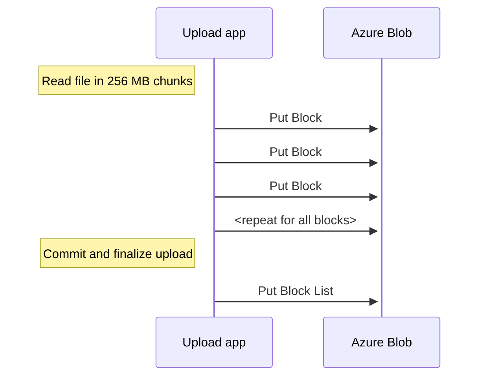

# BlockBlobs

Test parameters:
- Azure Storage: 
  - Account kind: StorageV2 (general purpose v2)
  - Performance: Standard (HDD)
  - Replication: Locally-redundant storage (LRS)
- Virtual Machine:
  - SKU: [Standard_D2ds_v4](https://learn.microsoft.com/en-us/azure/virtual-machines/ddv4-ddsv4-series#ddsv4-series)
- Upload code [Python upload code](https://github.com/JanneMattila/python-examples/tree/main/azure-storage)
  - 256 MB file generated using: `head -c 256m </dev/urandom > demo.bin`
  - Single large file is generated by uploading this file as [BlockBlob](https://learn.microsoft.com/en-us/rest/api/storageservices/understanding-block-blobs--append-blobs--and-page-blobs#about-block-blobs)
  - 4000 blocks will be generated using [Put Block](https://learn.microsoft.com/en-us/rest/api/storageservices/put-block?tabs=azure-ad) API
  - After uploading blocks, file is committed using [Put Block List](https://learn.microsoft.com/en-us/rest/api/storageservices/put-block-list?tabs=azure-ad) API call

Overview of the process:

Metrics view while uploading blocks using [Put Block](https://learn.microsoft.com/en-us/rest/api/storageservices/put-block?tabs=azure-ad) API:

Metrics view after uploading has finished and final [Put Block List](https://learn.microsoft.com/en-us/rest/api/storageservices/put-block-list?tabs=azure-ad) API call is made:

Entire upload duration API calls:

Uploaded file in container:

